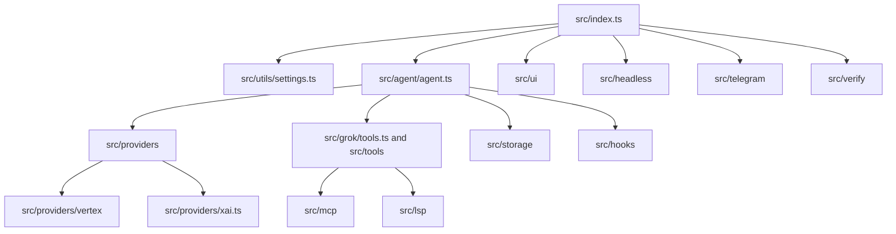

# Architecture

This document is for maintainers, reviewers, and contributors who need a fast
map of how `grok-cli-vertex` is put together.

## System Shape

`grok-cli-vertex` is a single-package TypeScript CLI built on Bun. The same
entrypoint supports interactive terminal UI, headless automation, scheduled
jobs, Telegram remote control, and local verification workflows.



## Request Lifecycle

1. `src/index.ts` parses CLI flags, loads environment variables, resolves
   settings, and selects interactive, headless, daemon, Telegram, or verify
   mode.
2. `Agent` owns the active model, session state, tool loop, delegation flow,
   hooks, and cleanup.
3. Provider selection is resolved through `createProvider()` in `src/providers`.
   Consumer code should depend on the `GrokProviderAdapter` contract instead of
   concrete provider implementations.
4. Tools are exposed through the agent loop and include local shell/file
   actions, MCP, LSP, scheduled jobs, verification tasks, and computer
   automation when available.
5. Session, transcript, usage, and delegation state are persisted under the
   local `.grok`/user settings model rather than through an external service.

## Provider Boundary

The provider layer is the main architectural seam in this fork.

- `src/providers/types.ts` defines `GrokProviderAdapter`, provider
  capabilities, runtime model resolution, hosted-tool availability, and the
  typed `ProviderCapabilityError`.
- `src/providers/xai.ts` preserves the inherited native xAI path for
  compatibility.
- `src/providers/vertex` maps Grok requests onto Vertex AI using Google
  Application Default Credentials and Vertex-specific model IDs.
- Provider capabilities deliberately gate unsupported surfaces. For example,
  Vertex mode disables xAI batch, hosted search, media generation, and audio STT
  instead of letting those paths fail with ambiguous API errors.

New provider-specific behavior should stay behind this boundary. If an agent or
UI call site needs to branch on backend behavior, prefer adding a capability to
the adapter contract over checking provider names directly.

## Runtime Modes

Interactive mode renders the OpenTUI React UI and keeps a long-lived agent
session attached to the terminal. Headless mode streams either human-readable
output or JSONL semantic events, which makes it suitable for scripts and CI
tasks. Scheduling and Telegram bridge flows reuse the same agent primitives with
different transport and lifecycle wrappers.

The verification entrypoint (`src/verify`) builds a task prompt that asks the
agent to detect, run, and report project-level checks. It is an agent workflow,
not a hardcoded test runner.

## State And Configuration

Settings are loaded from environment variables, user settings, and project
settings. Vertex mode is configured with a provider setting plus a Google Cloud
project and optional location:

```json
{
  "provider": "vertex",
  "vertex": {
    "projectId": "my-gcp-project",
    "location": "global"
  }
}
```

The native xAI fallback still uses `GROK_API_KEY`, `GROK_BASE_URL`, and related
settings. Vertex mode uses Google ADC and does not require `GROK_API_KEY` for
chat requests.

## Quality Gates

Current required CI gates are:

- `bun install --frozen-lockfile`
- `bun run format`
- `bun run lint`
- `bun run typecheck`
- `bun run build:binary`
- dependency lifecycle audit and secret scanning in the security workflow

The broader Vitest suite exists, but it is not currently a required CI gate.
As of this cleanup pass, a local full-suite run reports 50 passing test files
and 6 failing files. Do not add the full suite to required CI until the failing
provider/tool-schema and environment-dependent tests are addressed.
